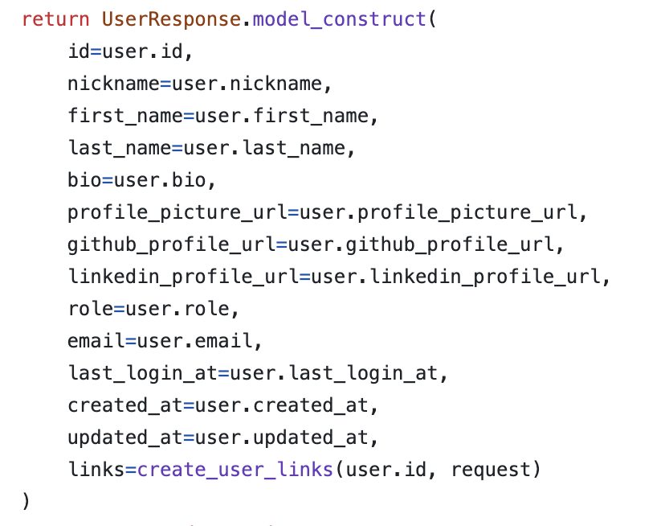
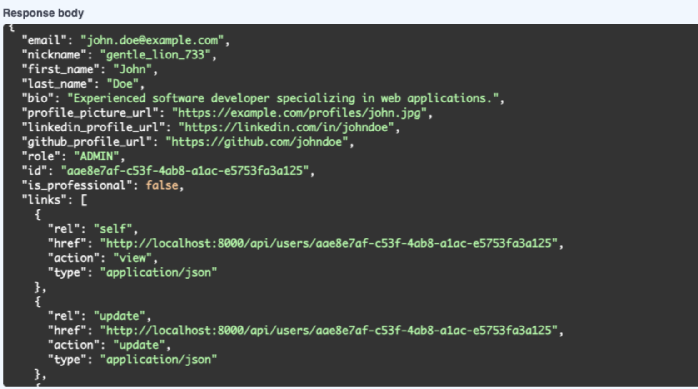

## API Design and Implementation

15. **What is HATEOAS (Hypermedia as the Engine of Application State)? Provide an example of its implementation in your project's API responses, along with a screenshot.**

HATEOAS is a stype that emphesizes using interactive links to help users with the API. It revolves around embedding hyperlinks within the response of API. 

For example, once we get a response back from the API, there should be a link generated to show you the documentation of its implementation. For example in the picture, we have a response model, and part of the links attribute, it creates a link  for this request type.

