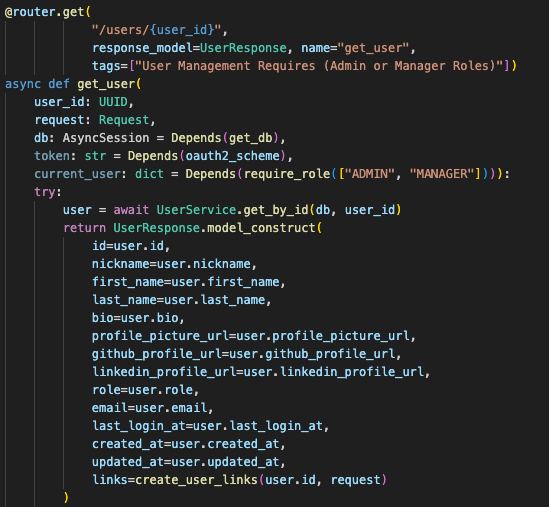

## Route Parameters and Pydantic Schemas

20. **How does FastAPI use Pydantic schemas to generate Swagger documentation? Provide an example from your project where a Pydantic schema is used and show the corresponding Swagger documentation.**

FastAPI uses the Pydantic user moels as an output to generate the output docuementation when testing the API through the browser.
For example, the user_model is returned back and displayed as the output for that API.

